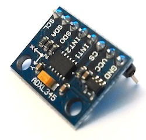
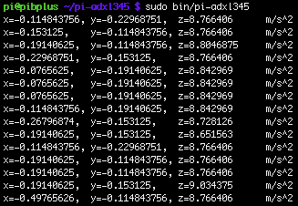
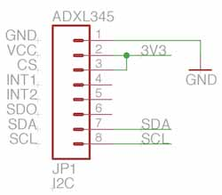

# Screenshot


# Instructions
## Schematic


## Computer
* Compile project
  * OS X/Linux: `$ ./gradlew distZip`
  * Windows `gradlew.bat distZip`
* ZIP file will be located in build/distributions
* Copy pi-adxl345.zip to your Raspberry Pi

## Raspberry Pi
```bash
$ unzip pi-adxl345.zip
$ cd pi-adxl345
$ sudo bin/pi-adxl345
```

# Troubleshooting
You can install i2c-tools by running:
```bash
$ sudo apt-get install i2c-tools
```

Then, confirm that your ADXL345 is recognized by running:
```bash
$ sudo i2cdetect -y 1
```

You should get an output similar to:
```
     0  1  2  3  4  5  6  7  8  9  a  b  c  d  e  f
00:          -- -- -- -- -- -- -- -- -- -- -- -- --
10: -- -- -- -- -- -- -- -- -- -- -- -- -- -- -- --
20: -- -- -- -- -- -- -- -- -- -- -- -- -- -- -- --
30: -- -- -- -- -- -- -- -- -- -- -- -- -- -- -- --
40: -- -- -- -- -- -- -- -- -- -- -- -- -- -- -- --
50: -- -- -- 53 -- -- -- -- -- -- -- -- -- -- -- --
60: -- -- -- -- -- -- -- -- -- -- -- -- -- -- -- --
70: -- -- -- -- -- -- -- --
```